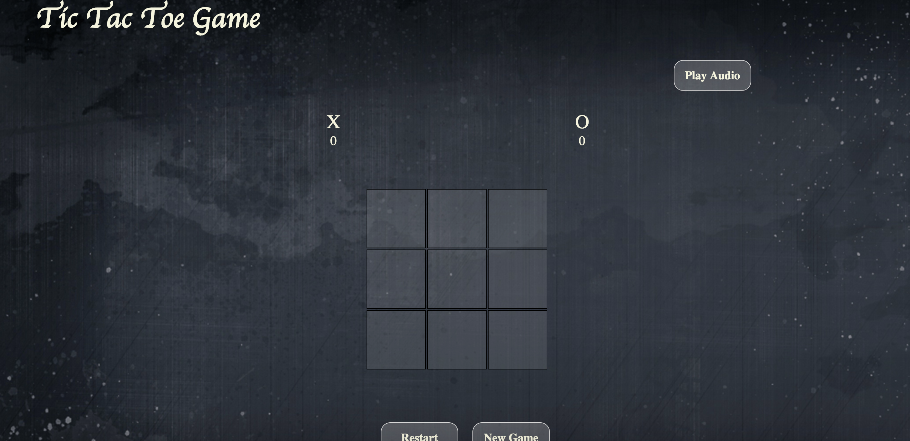

# Tic Tac Toe
 instructions:
 * First player is X and then O.
 * To win draw three of Xs or three of Os in a row or colume .

## The Game

## The Features 

* Audio tag to play music when the user plays.
* SweetAlert for popup massage it will show when the user win.
* LocalStorage :
is object stores data with no expiration date and the data will not be deleted when the browser is closed.
when player x or player o win it will save the score in LocalStorage and every time any player wins, the score will increase.

## The difficult part

To start codeing how the user can select the cell and then play with X then O and count how many times the player won .

## The best part 
* Make the html and css file .
* Make the user play.
* Add Audio to the page.

## Future work 
* Add new style to the page.
* Make the user play with computer.
* Add different levels.

## Acknowledgement
I want to thank everyone who helped me with the project.
Special thanks to Mr.Michael and Moath for help me with javaScript.Also, i grateful to Mr.Usman.
